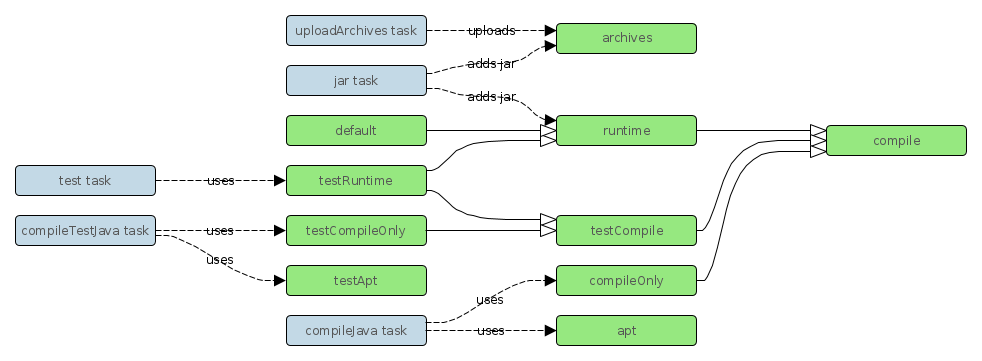

# Java Annotation Processing

This spec aims at making Java annotation processing a first-class citizen in Gradle.

## Use cases

 * Simplify configuration for Java annotation processing:
   * annotation processor dependencies used as `-processorpath` of the Java compiler, and
   * compile-time-only dependencies: e.g. containing annotations that are only needed at compile-time to be processed by annotation processors (e.g. Immutables.org or Google's "auto" projects), or possibly for documentation purpose only (e.g. `@Nullable`, `@NotNull` et al.)
 * Configure annotation processing in IDEs through the IDE-specific Gradle plugins (`./gradlew eclipse` or `./gradlew idea`)
 * Expose the configuration through the Tooling API for IDEs to configure themselves (Buildship, etc.)

## Implementation plan

### Add properties to `CompileOptions`

Add a `processorpath` (similar to the existing `sourcepath`), `processors` and `processorArgs`:

 * `processorpath` as a `FileCollection`: when non-empty, it is passed as a `-processorpath` argument to the Java compiler.
 * `processors` as a `List<String>` (or `Set<String>` or `Collection<String>`?); when non-empty, it is passed as a `-processor` argument to the Java compiler (values joined with a `,`).
 * `processorArgs` as a `Map<String, ?>` (or `Map<String, String>`?); each entry is passed as a `-Akey=value` argument to the Java compiler.

#### Backwards compatibility

 * The new arguments must be added before the `compilerArgs` so that user-specified arguments in `compilerArgs` override the ones added by those new properties (similar to how `compilerArgs` can override `sourcepath` added in Gradle 2.4, or any other compiler argument
 * An empty `processorpath` must not result in a `-processorpath` argument so that the default behavior still is to lookup annotation processors in the classpath.

#### Test cases

 * The default behavior doesn't change (no change in existing tests, e.g. in `JavaCompilerArgumentsBuilderTest` and `CommandLineJavaCompilerArgumentsGeneratorTest`)
 * a non-empty `processorpath` adds a `-processorpath` argument with `processorpath.asPath` as value
 * a non-empty `processors` list adds a `-processor` argument with the `processors` joined with a `,` as value
 * each entry in `processorArgs` is added as `-Akey=value` arguments

### Add processor path to `SourceSet`

Add a `processorpath` property to `SourceSet`, like the existing `compileClasspath`.

### Update the Java plugin to wire the above two `processorpath`s

Configure the `compileJava` task's `options.processorpath` to the `main` source set's `processorpath`, and similarly for the `compileTestJava` task and `test` source set.

#### Test cases

Set the source set's `processorpath` and check that it's reflected in the corresponding task's `options.processorpath`.

### Create default/conventional dependency configurations

For each source set (`main` and `test`), create an `apt` (resp. `testApt`) configuration and wire it as the source set's `processorpath`.

Also create, for each source set, a `compileOnly` (resp. `testCompileOnly`) configuration that extends the `compile` (resp. `testCompile`) configuration, and wire it as the `JavaCompile`'s `classpath` (in lieu of the `compile` –resp. `testCompile`– configuration).

## Open for discussion

 * Should  `CompileOptions` also have a property for the `-proc:none` / `-proc:only` Java compile arguments?
 * Should the `testApt` configuration extends from the `apt` one?
 * Similarly, should the `testCompileOnly` configuration extends from the `compileOnly` one?
 * Should there be a new task to call annotation processors on already-compiled classes (passing the class names to the Java compiler in lieu of source file names), possibly coming from dependencies.

